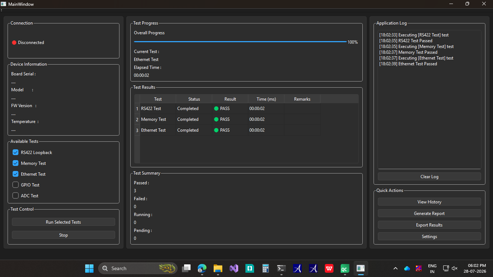

# 🚀 Hardware Test Executive

A professional **Qt (C++) desktop application** that simulates a Hardware Test Executive used for testing embedded hardware modules.

This project is inspired by real-world Aerospace and Defense test applications where a host PC communicates with embedded hardware to execute diagnostics and display test results.

---

## 📷 Application Screenshot



---

# Features

- ✅ Modern Qt Widgets based GUI
- ✅ Select multiple hardware tests
- ✅ Execute selected tests dynamically
- ✅ Real-time Application Log
- ✅ Test Results Table
- ✅ Overall Progress Bar
- ✅ Pass / Fail Statistics
- ✅ Execution Time Display
- ✅ Object-Oriented Design
- ✅ Modular Test Architecture

---

# Current Implemented Tests

- RS422 Test
- Memory Test
- Ethernet Test
- GPIO Test *(Architecture Ready)*
- ADC Test *(Architecture Ready)*

---

# Technologies Used

- C++
- Qt 6
- Qt Widgets
- CMake
- Object-Oriented Programming
- Git
- GitHub

---

# Software Architecture

The project follows a modular architecture based on **Abstraction**, **Inheritance**, and **Polymorphism**.

```
                 MainWindow
                      │
                      ▼
             QVector<BaseTest *>
                      │
      ┌───────────────┼────────────────┐
      ▼               ▼                ▼
  RS422Test      MemoryTest      EthernetTest
                      │
                GPIOTest
                      │
                  ADCTest
```

Each hardware test inherits from the abstract `BaseTest` class and implements its own execution logic.

---

# Class Responsibilities

## BaseTest

Abstract interface shared by every hardware test.

Responsible for:

- Providing a common interface
- Returning TestResult
- Maintaining test name

---

## Derived Test Classes

Each hardware test is implemented as its own class.

Examples:

- RS422Test
- MemoryTest
- EthernetTest
- GPIOTest
- ADCTest

Each class overrides:

```cpp
TestResult execute();
```

---

## TestResult

A common structure used by every test.

Contains:

- Status
- Execution Time
- Failure Reason

---

## MainWindow

Responsible only for GUI operations.

- Test Selection
- Progress Bar
- Results Table
- Application Log
- Pass/Fail Statistics

Business logic is separated from the UI.

---

# Execution Flow

```
User Selects Tests
        │
        ▼
Create Test Objects
        │
        ▼
Store in QVector<BaseTest *>
        │
        ▼
Execute Each Test
        │
        ▼
Receive TestResult
        │
        ▼
Update GUI
```

---

# Example Output

| Test | Status | Time | Failure Reason |
|------|--------|------|----------------|
| RS422 Test | 🟢 PASS | 00:00:02 | None |
| Memory Test | 🟢 PASS | 00:00:01 | None |
| Ethernet Test | 🔴 FAIL | 00:00:03 | Timeout |

---

# Learning Objectives

This project demonstrates:

- Qt Widgets Development
- Object-Oriented Programming
- Abstract Classes
- Virtual Functions
- Inheritance
- Polymorphism
- Modular Software Design
- GUI Programming
- Dynamic Object Creation
- Memory Management
- Git Version Control

---

# Project Structure

```
HardwareTestExecutive/
│
├── MainWindow
│
├── Tests/
│   ├── BaseTest
│   ├── TestResult
│   ├── RS422Test
│   ├── MemoryTest
│   ├── EthernetTest
│
├── Screenshots/
│
├── CMakeLists.txt
│
└── README.md
```

---

# Current Version

## ✅ Version 2.0.0

### Highlights

- Introduced abstract `BaseTest`
- Added polymorphic test execution
- Common `TestResult` structure
- Dynamic execution using `QVector<BaseTest*>`
- Shared UI update function
- Modular architecture
- Improved code reusability
- Reduced duplicate code

---

# Roadmap

## Version 3.0

- Test Manager
- Packet Builder
- Packet Parser
- Simulated RS422 Communication
- Export Test Report (PDF)
- Test Configuration using JSON
- Test Statistics Dashboard

---

# Build

Clone the repository

```bash
git clone https://github.com/kiranayaka/Hardware-Test-Executive.git
```

Open using **Qt Creator**.

Configure using **CMake**.

Build and Run.

---

# About

This project is developed as a personal learning project to improve modern C++ and Qt skills while following software architecture practices commonly used in Hardware Test Executive applications.

Future versions will simulate real hardware communication, packet transmission, automated testing, and report generation.

---
# 📌 Version History

| Version | Description |
|----------|-------------|
| **v2.0.0** | Introduced modular architecture using BaseTest, polymorphism, reusable TestResult, and dynamic test execution. |
| **v1.0.0** | Initial Hardware Test Executive prototype with Qt Widgets UI and basic simulated hardware tests. |


## ⭐ If you like this project, consider giving it a Star!
